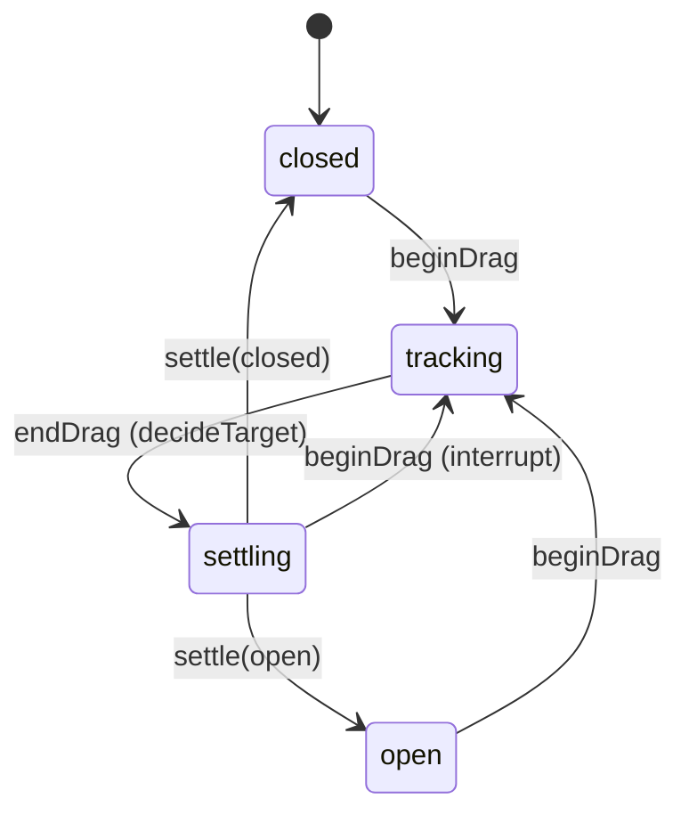

# Phase 9 – Gesture + Overview Physics (Safari-like)

## Goals
- Centralize gesture/physics tuning (no scattered magic numbers)
- Make overview transitions interruptible and reversible
- Keep logic deterministic and testable (pure state machines)

## Overview Transition State Machine

## Central Config
- `SafariPhysicsConfig.default`
  - Overview open distance: 320pt
  - Settle threshold: 0.50 (projected: 0.52)
  - Spring: response 0.34, damping 0.90
  - Tab card: close threshold 120pt, dismiss threshold 140pt

## Notes
- UI animations are driven by `targetProgress`, while `presentationProgress` tracks the in-flight value via an animatable observer.
- Gesture closures emit events into a controller/state machine; decisions remain pure/deterministic.
