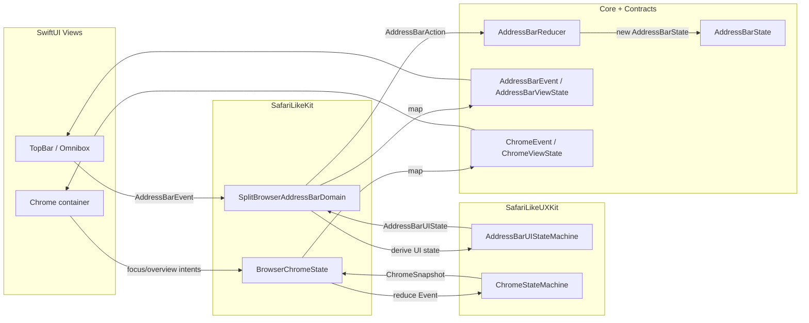

# Address Bar / Chrome State Flow (Scaffolding)

Goal: define stable, UI-safe contract types for Address Bar + Chrome state/event ownership, without changing behavior.

## Current sources of truth

### Address Bar

- Core (deterministic UX state): `SafariLikeContracts.AddressBarState`
- Core reducer: `SafariLikeCoreKit.AddressBarReducer`
- UI rendering model: `SafariLikeUXKit.AddressBarUIState`
- UI state machine (pure): `SafariLikeUXKit.AddressBarUIStateMachine`
- Current owner in app layer: `SafariLikeKit.SplitBrowserAddressBarDomain`

### Chrome

- Pure chrome machine: `SafariLikeUXKit.ChromeStateMachine`
- Snapshot value: `SafariLikeUXKit.ChromeSnapshot`
- Current owner in app layer: `SafariLikeKit.BrowserChromeState`

## Contracts added (UI-safe)

- `SafariLikeContracts.AddressBarEvent`, `SafariLikeContracts.AddressBarViewState`
- `SafariLikeContracts.ChromeEvent`, `SafariLikeContracts.ChromeViewState`

These types avoid CoreKit/WebKit objects and only use primitives.

## State flow diagram

## What changed (no behavior)

- `SplitBrowserAddressBarDomain` gained a protocol adapter surface (`AddressBarStateProviding`) via mapping:
  - Contracts `AddressBarEvent` -> UXKit `AddressBarUIEvent`
  - UXKit `AddressBarUIState` -> Contracts `AddressBarViewState`
- `BrowserChromeState` gained a `chromeViewState` computed mapping from its `chromeSnapshot`.

## Migration points (next PR)

- Update `TopBarView` / omnibox views to render from `AddressBarViewState` (contract) rather than directly from UXKit `AddressBarUIState` or ad-hoc fields.
- Route address-bar intent entrypoints in `SplitBrowserViewModel+ChromeState.swift` through `AddressBarEvent` (contract) instead of directly calling `AddressBarUIEvent`.
- Optional: introduce a `ChromeStateProviding` protocol once `BrowserChromeState` is slimmed or split (keeping file-scope-private dispatch constraints in mind).
