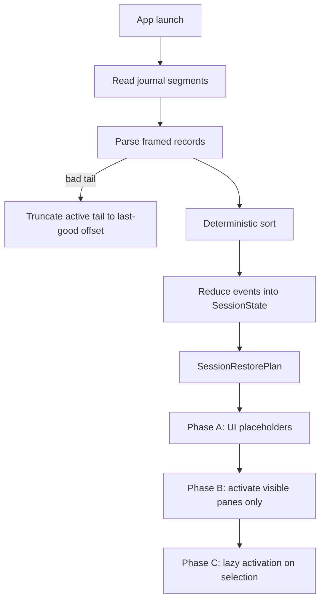

# Session Journal Restore (Crash-Safe)

This project restores session structure from an **append-only journal** (and its archived segments), then lazily re-attaches WebKit only for visible panes.

## Files

- [RuntimePackages/BrowserCore/Sources/BrowserCore/Session/Journal/SessionJournal.swift](../RuntimePackages/BrowserCore/Sources/BrowserCore/Session/Journal/SessionJournal.swift)
- [RuntimePackages/BrowserCore/Sources/BrowserCore/Session/Journal/SessionRestorer.swift](../RuntimePackages/BrowserCore/Sources/BrowserCore/Session/Journal/SessionRestorer.swift)
- [RuntimePackages/BrowserCore/Sources/BrowserCore/Session/Restore/SessionReplayEngine.swift](../RuntimePackages/BrowserCore/Sources/BrowserCore/Session/Restore/SessionReplayEngine.swift)
- [RuntimePackages/BrowserCore/Sources/BrowserCore/Session/Restore/SessionReducer.swift](../RuntimePackages/BrowserCore/Sources/BrowserCore/Session/Restore/SessionReducer.swift)

## Replay Flow

## Event Categories

- **Structural**: `windowCreated`, `splitModeChanged`, `tabCreated`, `tabMovedPane`, `tabClosed`
- **Selection/focus**: `paneFocusChanged`, `tabSelected`
- **Navigation**: `navigationCommitted` / `urlCommitted`
- **Lifecycle**: `tabSuspended`, `tabDiscarded`

## Crash Safety

- Each journal record is framed (`JRNL` header + payload length + CRC32) so a crash mid-write leaves an incomplete final record.
- On read, the parser stops at the first invalid record and truncates only the active tail file back to the last known-good boundary.
